# User Guide

## Accessing Regress & the dashboard

Go to [http://regress.silverstripe.com](http://regress.silverstripe.com/).  

This will take you to your Dashboard. The dashboard shows you a list of all the test to which you have access. Most test scripts are grouped into multiple sections. You can either select the top level of a test to see everything, or a subsection.

For each test, you also get a link to

*   Perform test
*   View test script - this takes you to a version of the test script without the form fields to submit results
*   View results - this takes you to a list of all the completed test sessions for the selected script, and links to click through to details.

## Performing a test

From the dashboard, find the test you want to run and click "Perform test." This takes you to the test form.

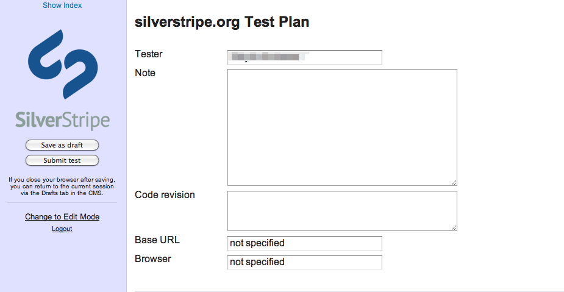

*   **Tester** will be pre-populated with the name associated with your user account.
*   **Note** is for any relevant information about your test execution, such as assumptions you made, or limitations of your testing environment.
*   **Code revision**: Add the version of the code you are testing - you may have to ask the developer for this information.
*   **Base URL**: Enter the URL of the site or application which you are testing.
*   **Browser**: Enter the Browser (incl. version and OS) which you are using to run the test.

### Running the test

*   **Show Index** in the upper left corner shows you the index/outline of the entire test.
*   You can always click on the SilverStripe logo to get back to the dashboard.
*   Regress will auto-save your results regularly. You can also explicitly save your work to date by clicking the **Save as draft** button.

### Logging results

Go through the test scenarios one by one. For each, follow the steps as they are described, and log the results.

*   Select **Pass** if the system is behaving exactly in the way described in the test plan.
*   Select **Fail** the system doesn't behave exactly in the way described in the test plan (see also below.)
*   Select **Skip** if you couldn't test this step. Add the reason why in the comments field.

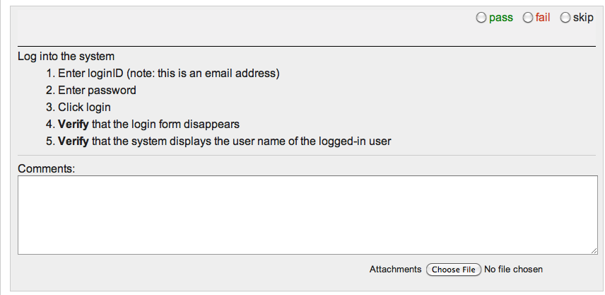  

If you've selected fail, you can now log the severity of the issue:

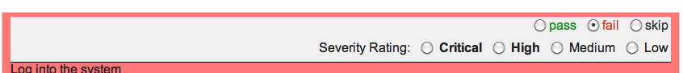

*   Critical: major impact, testing cannot continue
*   High: major impact, potentially a workaround exists, testing can continue
*   Medium: medium impact, e.g., usability problem
*   Low: minor or no impact, e.g., cosmetic error

You can also hover over the severity fields to see an explanation on the screen.

In the **Comments** field, explain exactly how the test failed (at which step, what was the behaviour.)

If you need to illustrate an issue visually, you can submit one or more screenshots as **Attachments**.

### Submitting the test

When you have completed all test scenarios, click the **Submit test** button.

Once a test is submitted, the results are accessible from the dashboard link.

## Editing a test

If you have editing rights (set up by the project manager), you can make changes to the test script directly while you are performing a test. This is useful if you find that a test step is missing, or shouldn't be there at all, or if you find mistakes with an existing test step.

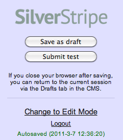In the left panel, click **Change to Edit Mode**.

This highlights all editable fields with a light green colour. Double-click a green-highlighted field to start typing. Regress uses Markdown for formatting ([Markdown Syntax](http://daringfireball.net/projects/markdown/syntax).)  

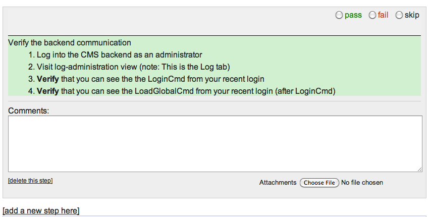In addition, you can also

*   **delete this step** to remove a test step from the script - when in doubt, check with the PM or QA manager before doing so
*   **add a new step** here to insert a new test step

When you are done editing, switch back to read-only mode to avoid making accidental changes, by clicking **Set to read-only mode** in the left panel.

## Viewing results

On the dashboard, select the test you are interested in, and click on view results to see a list of completed tests (only submitted tests are shown, not those in draft state.)

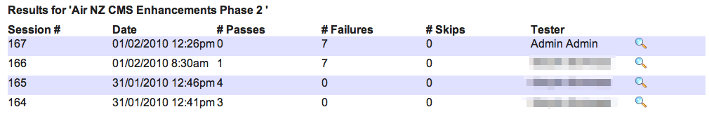  

Click on the magnifying glass icon to view the details for a particular session. This gives you a summary, followed by the individual results for failed steps or steps with comments.

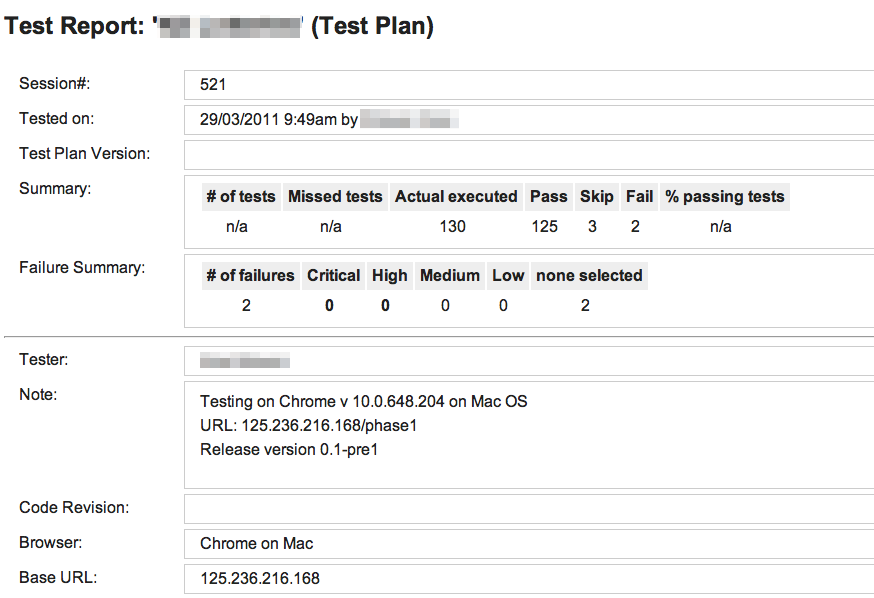  

When you view results for test failures, you can add additional comments, change the severity, or mark the issue as resolved.  

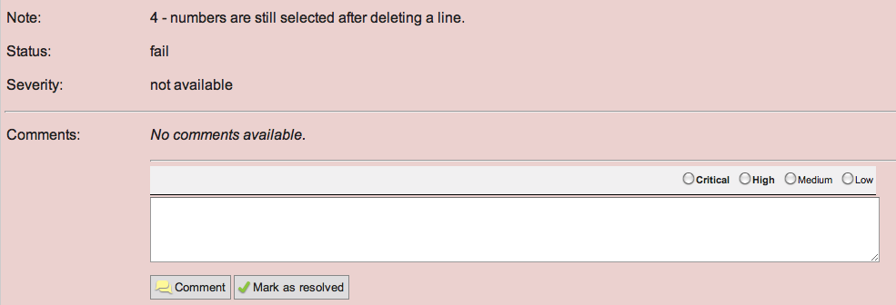

## For project managers

### Creating new tests in the CMS

To create or edit a test, log in to the CMS: [http://regress.silverstripe.com/admin](http://regress.silverstripe.com/admin) (you have to be set up as an admin.)  

Select the appropriate section in the site tree (e.g., Client Tests), the click Create and create a Test Plan.

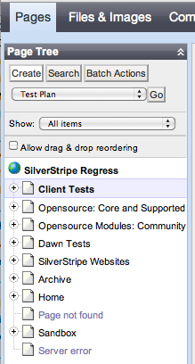

In the **Edit** tab, add

*   **Name** - the name of the test plan. In the case of client projects, this is typically the client organisation's name.
*   **Description** - a description of what the test covers, and which project or document it relates to
*   **Version** - the version of the test plan (start with 1.0)
*   **Test status** - "new" by default, change to draft, changed, and final as appropriate as testing progresses

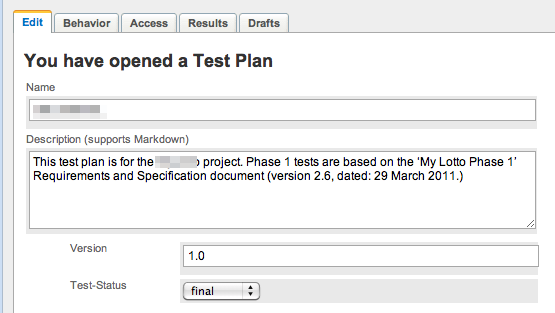  

Once you've set up the top-level test plan, click Create to add a new Feature. Features are used for major areas of functionality of the site or application you're testing. You can nest features within feature for further grouping.

A feature contains a number of metadata fields and the actual test scenarios. The metadata fields are

*   **Name** - the name of the feature, e.g., Login functionality
*   **Feature ID** - a reference to an story card or a section in a specification
*   **Description** - high-level description/user goals of the feature you're testing
*   **Test Preparation** - actions that need to happen before the test can take place, e.g., setting up an admin account
*   **Test Data** - specific data to run the test with
*   **Notes** - any other considerations or relevant information

All fields support Markdown for formatting ([Markdown Syntax](http://daringfireball.net/projects/markdown/syntax).)

The information you enter here will be displayed on the front end when someone runs the test or views the script.

### Setting up client users

It can be helpful to share a regression test with the client so they can  

*   See what we are testing against
*   Run the test themselves

#### Process

*   In the **Security** tab in the CMS, create a group within the **Clients** folder.

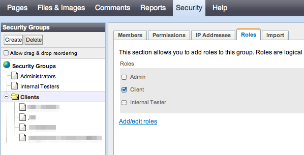

*   Name the group after the client organisation.
*   Make sure the **Role** is set to **Client**.
*   Add members to the group (make sure they are only members of that particular group, not any of the top-level groups.

*   In the Pages section of the CMS, select the test for the respective client. In the **Access** tab, add them to the groups that can view the page to allow them to run tests and view results. If you also want them to be able to edit tests, add them to the groups that can edit the page.

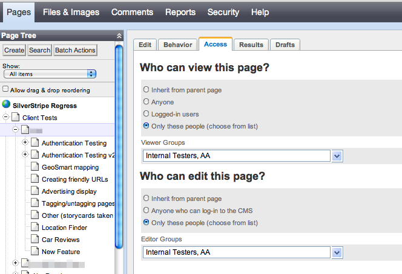  
Important: Make sure you only select the respective client group, never the Clients parents directory. (Sibylle: We are planning to change it so this can't be done by accident in the future.)

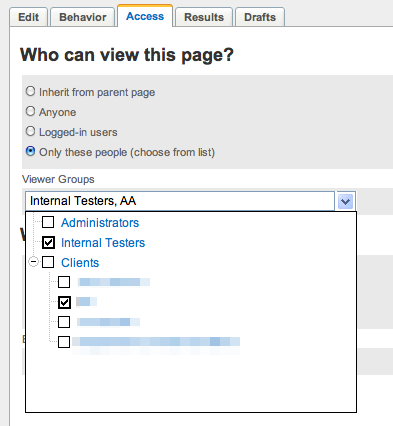

*   Log in as the client to test the accounts you've set up, and make sure they can't see anyone else's tests. Once you've confirmed, share the login details with the client.

**Recommendations for PMs**

*   Make sure the client understands clearly what the Regress tool is and isn't:

*   It's SilverStripe's internal testing tool - as such it may be unavailable at times as we update it.
*   It's not a bug tracker but a tool to (repeatedly) run through testing scenarios.
*   Marking something as "fail" in Regress doesn't automatically mean that the issues gets addressed for free as part of the project (see below.)

*   If your client uses Regress to run tests for their project, set aside time for afterward to review the outcomes with them. Not everything that is marked as "fail" is necessarily going to be addressed as part of the project. Discuss items in question with the client and manage as you would any other bug report.
*   It's your responsibility as PM to make sure that legitimate issues are going to be addressed. Clarify the process with the client upfront (e.g., the client submits their test results, you discuss jointly, and then you as PM log the issues in Agile Zen.)

